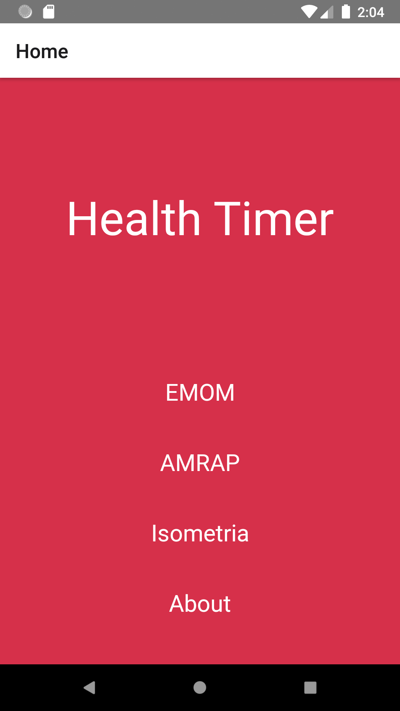
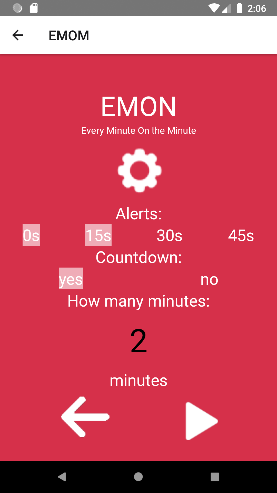
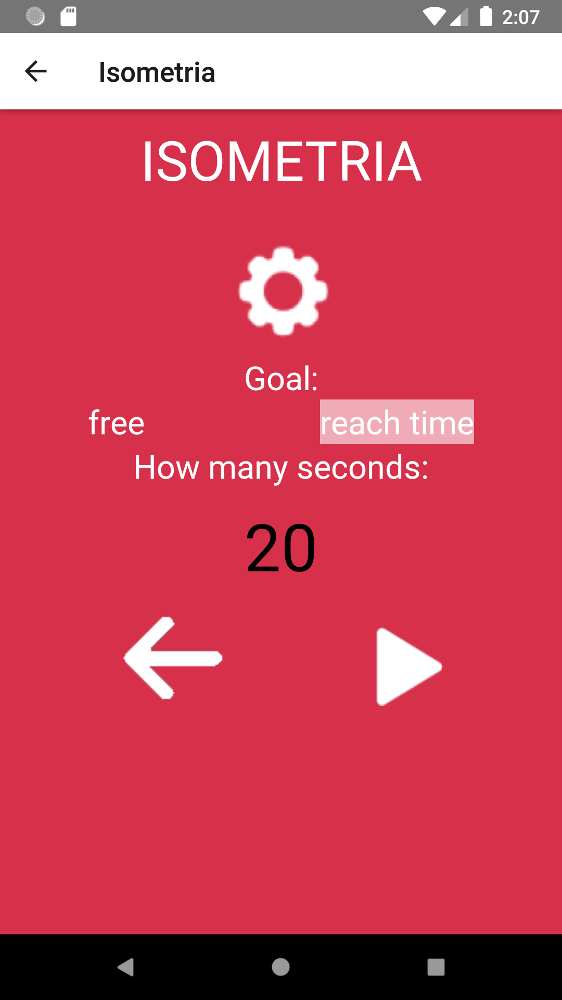

# Health-Timer
This is a timer for physical activities done in react native.  
 

EMON - it's a simple minute counter. 
 

AMRAP - The goal is to count minutes with repetitions. 
 

Isometria - It's a simple seconds count. 
 
